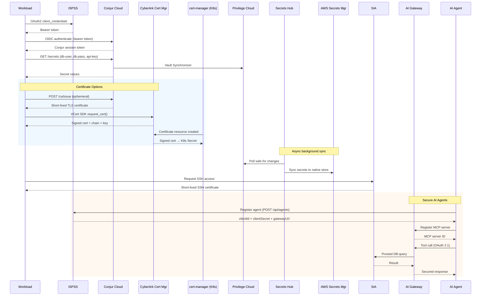

# Machine Identity Portfolio — Demo Validation

## Overview

This document walks through the runtime demo (`demo.sh`) which demonstrates the full CyberArk machine identity portfolio in a single interactive workflow. Assumes setup is complete.

## Starting Point

```bash
cd $CYBR_DEMOS_PATH/demos/machine_identity/portfolio_workflow
./demo.sh
```

The demo is interactive — press ENTER to advance between steps.

## About — CyberArk Components Used

| Component | Role in Demo |
|---|---|
| **ISPSS** | Central authentication — OAuth2 bearer token for all services |
| **Conjur Cloud** | Workload identity, secret retrieval, ephemeral PKI certs |
| **CyberArk Certificate Manager** | Full cert lifecycle via VCert SDK and cert-manager |
| **Privilege Cloud** | Secure vault for credentials (safe + accounts) |
| **Secrets Hub** | Sync secrets from PAM vault to cloud-native stores |
| **SIA** | Just-in-time SSH certificate access to infrastructure |
| **SCA** | Just-in-time cloud role elevation |
| **Secure AI Agents** | Agentic identity lifecycle, AI Gateway MCP server inventory |

## Workflow



## Core Validation

### Step 1: ISPSS Authentication
- Verify bearer token is returned (first 20 chars displayed)
- Token format: `eyJ...` (JWT)

### Step 2: Conjur Cloud Authentication
- OIDC exchange converts ISPSS token to Conjur session token
- Token is base64-encoded

### Step 3: Secret Retrieval
- Three secrets fetched individually via REST API
- Values are masked in output (first 3 chars visible)
- If secrets show `(not found)`, run `setup.sh` first

### Step 4a: Conjur Cloud PKI
- If PKI is configured: displays certificate subject and validity dates
- If not configured: explains the capability and integration points
- **What to look for**: cert issued with short TTL (seconds/minutes)

### Step 4b: VCert Python SDK
- Runs the full lifecycle: request → retrieve → renew → revoke
- Three modes: SaaS (API key), Self-Hosted (TPP), or fake (demo)
- **What to look for**: request ID, cert PEM header, chain count, renewal success
- If vcert not installed: shows capability overview with code example

### Step 4c: cert-manager + CyberArk Issuer
- Shows Issuer, Certificate, and Secret resources in the K8s namespace
- Decodes the TLS secret and displays cert subject/issuer/dates
- **What to look for**: Issuer `Ready=True`, Certificate `Ready=True`, Secret with `tls.crt` + `tls.key`
- If no cluster: shows configuration overview

### Step 4 Comparison Table
- Side-by-side matrix of all three certificate approaches
- Compares: approach, TTL, renewal, revocation, best fit, identity model, CA backend

### Step 5: Secrets Hub Sync
- Lists active sync policies with source → target direction
- Lists configured secret stores by type (PAM, AWS_ASM, AKV, etc.)

### Step 6: SIA — JIT SSH
- Lists SIA connection targets with platform type
- Explains zero-standing-privilege model

### Step 7: SCA — JIT Cloud Access
- Lists access policies if configured
- Explains time-bounded cloud role elevation

### Step 8: Secure AI Agents
- Lists registered AI agents with name, type, and lifecycle state
- Displays agent detail (clientId, gatewayUrl, tags, callback URLs)
- Queries AI Gateway MCP server inventory
- **What to look for**: agent state `ACTIVE` (or `PENDING_CONNECTION` if not yet configured), MCP server entries with upstream URLs
- If `SAI_AGENT_NAME` not set: explains the capability and registration flow
- **Roles required**: `Secure AI Admins` or `Secure AI Builders`
- **MCP inventory URL**: `https://{tenant-name}.cyberark.cloud/adminportal/aigw/mcp/inventory` (not yet in left sidebar — access via direct URL)
- **MCP servers for testing**: Context7 passthrough (`https://mcp.context7.com/mcp/oauth`), Context7 no-auth (`https://mcp.context7.com/mcp`), SIA DB MCP (created via API)
- **Tenant prep reference**: See [`setup/sai/dp_tenant_preparations.md`](setup/sai/dp_tenant_preparations.md) for role creation API, SIA MCP creation API, and known issues

### Summary Table
- All 9 components with what was demonstrated
- Certificate strategy recommendation by workload type
- Identity types secured (human, machine, agentic)

## Troubleshooting

| Symptom | Cause | Fix |
|---|---|---|
| Token is `null` | Bad credentials | Check `tenant_vars.sh` |
| Secrets `not found` | Setup not run or sync pending | Run `setup.sh`, wait for sync |
| Secrets Hub `0 policies` | No sync configured | Set `SH_AWS_*` vars and re-run setup |
| SIA `0 targets` | No SIA configured | Set `SIA_TARGET_HOST` and re-run setup |
| Conjur PKI `not configured` | PKI not enabled on tenant | Contact CyberArk admin to enable |
| VCert `fake connection` | No Certificate Manager creds | Set `VCERT_API_KEY` or `VCERT_TPP_*` |
| VCert `import error` | SDK not installed | Run `pip3 install vcert` |
| cert-manager `no issuers` | Setup not run or no cluster | Run `setup.sh` with kubectl access |
| Certificate `not ready` | Pending CyberArk approval or misconfigured zone | `kubectl describe certificate` for details |
| Issuer `not ready` | Bad credentials or wrong TPP URL | `kubectl describe issuer` for error |
| SAI `0 agents` | No agent registered | Set `SAI_AGENT_NAME` and re-run setup |
| SAI `409 Conflict` | Agent name already exists | Script handles this (idempotent) |
| SAI agent `PENDING_CONNECTION` | Agent not yet activated | May need gateway config before activation |
| AIGW `0 MCP servers` | No MCP server registered | Set `SAI_AIGW_SIA_MCP_URL` and re-run setup |
| AIGW `403 Forbidden` | Missing role | Ensure service account has `Secure AI Admins` or `Secure AI Builders` role |
| AIGW MCP inventory not in sidebar | Early-release UI limitation | Access directly via `https://{tenant-name}.cyberark.cloud/adminportal/aigw/mcp/inventory` |
| AIGW MCP inventory filter broken | Known issue | Browse manually; filter fix pending |
| Context7 + OAuth not working in Claude Desktop/Web | Known issue | Use passthrough mode or no-auth endpoint for testing |
| `Secure AI Builders` role missing | SAI installed before role existed | Reinstall SAI or create via `POST /roles/storerole` — see [`setup/sai/dp_tenant_preparations.md`](setup/sai/dp_tenant_preparations.md) |
