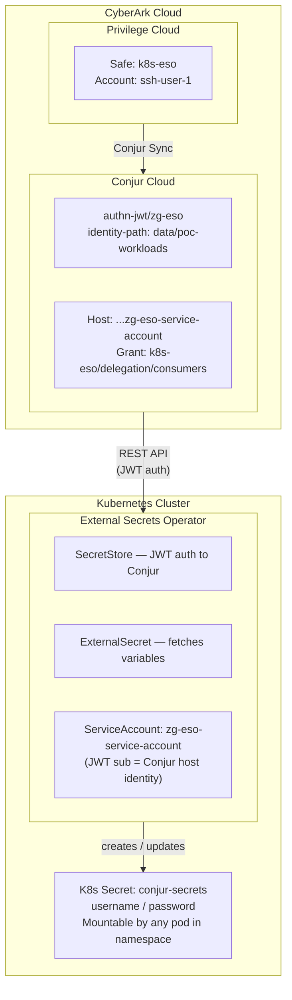
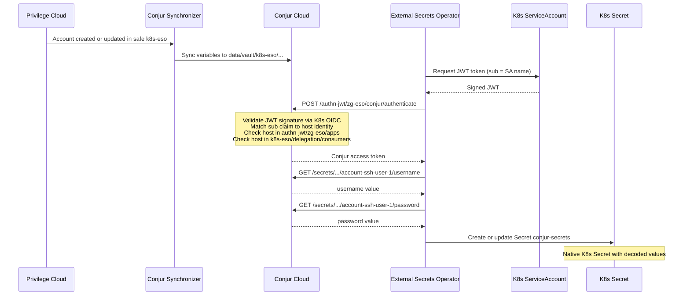

# ESO + CyberArk Conjur Cloud — Demo Validation

External Secrets Operator pulls credentials from CyberArk Conjur Cloud into native Kubernetes secrets via JWT authentication. Privilege Cloud is the single source of truth. Secrets sync through Conjur Cloud, and ESO handles the last mile into K8s.

## Start Here

Confirm your kubectl context and ESO namespace:

```bash
kubectl config current-context
kubectl get ns external-secrets
```

All resources in this demo live in the `external-secrets` namespace.

## About

| Component | Role |
|---|---|
| **Privilege Cloud** | Source of truth — safes, accounts, passwords, rotation policies |
| **Conjur Synchronizer** | Replicates Privilege Cloud safes and accounts into Conjur Cloud variables |
| **Conjur Cloud** | Secrets manager — JWT authentication, policy-based access control, API retrieval |
| **External Secrets Operator** | K8s controller — watches ExternalSecret CRs, authenticates to Conjur, writes K8s Secrets |
| **K8s ServiceAccount** | Workload identity — JWT token is the authentication credential |

## Architecture



## Workflow



## Core Validation

Verify ESO pods are running:

```bash
kubectl get pods -n external-secrets
```

Expected: three pods (`external-secrets`, `-webhook`, `-cert-controller`) all `Running` with `1/1` ready.

Verify the service account exists:

```bash
kubectl get sa -n external-secrets zg-eso-service-account
```

## Pattern: JWT-Authenticated Secret Retrieval

### What it does

ESO uses the K8s service account JWT token to authenticate to Conjur Cloud. Conjur validates the JWT against the cluster's OIDC discovery endpoint, maps the `sub` claim to a host identity, checks group membership, and returns the requested secret values. ESO writes them into a native K8s Secret.

### Identity and access controls

| Layer | Control |
|---|---|
| **JWT token** | Minted from `zg-eso-service-account` in `external-secrets` namespace |
| **Conjur host** | `data/poc-workloads/system:serviceaccount:external-secrets:zg-eso-service-account` |
| **Authenticator** | `authn-jwt/zg-eso` — host must be in the `apps` group |
| **Safe access** | Host must be in `data/vault/k8s-eso/delegation/consumers` |
| **Identity path** | `data/poc-workloads` — prepended to JWT `sub` to resolve the host |

### What to validate

**SecretStore health:**

```bash
kubectl get secretstore -n external-secrets conjur
kubectl describe secretstore -n external-secrets conjur
```

Look for `Status: Valid` and `Condition: Ready = True`. A failing SecretStore means the JWT auth handshake to Conjur is broken.

**ExternalSecret sync status:**

```bash
kubectl get externalsecret -n external-secrets conjur
kubectl describe externalsecret -n external-secrets conjur
```

Look for `Status: SecretSynced` and a recent `Last Synced Time`. The refresh interval of `1m` means ESO re-fetches every 60 seconds.

**K8s Secret contents:**

```bash
kubectl get secret -n external-secrets conjur-secrets -o yaml
```

Decode the values:

```bash
kubectl get secret -n external-secrets conjur-secrets \
  -o jsonpath="{.data.username}" | base64 --decode && echo

kubectl get secret -n external-secrets conjur-secrets \
  -o jsonpath="{.data.password}" | base64 --decode && echo
```

### What the result proves

- ESO can reach Conjur Cloud over HTTPS.
- The JWT from `zg-eso-service-account` passes Conjur signature validation.
- The `sub` claim maps to the correct host via `identity-path`.
- The host has authenticator access (`authn-jwt/zg-eso/apps`) and safe access (`k8s-eso/delegation/consumers`).
- Conjur returned the variable values and ESO wrote them to a native K8s Secret.
- No static API key, no sidecar, no init container — controller-based sync only.

### CyberArk behavior

When ESO triggers a sync:

1. ESO requests a JWT from the K8s TokenRequest API for `zg-eso-service-account` with audience `https://conjur.cyberark.com`.
2. ESO POSTs the JWT to Conjur's `authn-jwt/zg-eso` endpoint.
3. Conjur fetches the cluster's JWKS keys via the configured `jwks-uri` to validate the signature.
4. Conjur extracts the `sub` claim and prepends `identity-path` to resolve the full host ID.
5. Conjur checks the host is a member of `authn-jwt/zg-eso/apps`.
6. For each variable request, Conjur checks the host has `read` and `execute` on the variable, granted via `k8s-eso/delegation/consumers`.
7. Conjur returns the secret value. ESO base64-encodes it into the K8s Secret.

## Rotation Behavior

Password changes in Privilege Cloud propagate automatically:

1. Password changed or rotated in Privilege Cloud.
2. Conjur Synchronizer picks up the change (typically within seconds).
3. On the next ESO refresh interval (1 minute), ESO re-authenticates and fetches the updated value.
4. ESO updates the K8s Secret in place — no pod restart, no redeployment.

Verify the refresh interval:

```bash
kubectl get externalsecret -n external-secrets conjur \
  -o jsonpath="{.spec.refreshInterval}" && echo
```

The `demo.sh` script includes a live rotation step that captures the current password, waits for you to change it in Privilege Cloud, then polls every 10 seconds until the K8s secret updates.

## Visual Exploration with k9s

k9s provides a live terminal dashboard for Kubernetes resources. It is significantly more engaging for demos than raw `kubectl` output.

### Install

```bash
brew install derailed/k9s/k9s    # macOS
curl -sS https://webi.sh/k9s | sh  # Linux
```

### Launch

```bash
k9s -n external-secrets
```

### Recommended Views

| Shortcut | View | What to show |
|---|---|---|
| `:secretstores` | SecretStore list | `conjur` with `Valid` status |
| `:externalsecrets` | ExternalSecret list | Sync status and last refresh time |
| `:secrets` | Secret list | `conjur-secrets` — press `x` to decode live |
| `:pods` | Pod list | ESO controller health — press `l` for logs |
| `:events` | Cluster events | Real-time sync events |

### Key Bindings

| Key | Action |
|---|---|
| `x` | Decode secret values (on a secret resource) |
| `d` | Describe resource — full status and conditions |
| `l` | Tail logs (on a pod) |
| `/` | Filter — type a string to narrow the list |
| `Esc` | Go back one view |
| `:q` | Quit k9s |

### Demo Flow in k9s

1. `:secretstores` — show `conjur` connection is `Valid` and `Ready`.
2. `:externalsecrets` — show `SecretSynced` status with `LAST SYNC` timer.
3. `:secrets` — highlight `conjur-secrets`, press `x` to decode values live.

This three-view sequence tells the full story in about 60 seconds.

### Rotation Demo with k9s

For maximum visual impact:

1. Open k9s to `:secrets` and decode `conjur-secrets` with `x`.
2. In a second terminal or browser tab, change the password in Privilege Cloud.
3. Watch k9s. Within 60 seconds the secret value updates in the decoded view.
4. No pod restart, no redeployment — the audience sees it happen live.

## Troubleshooting

### SecretStore not valid

```bash
kubectl describe secretstore -n external-secrets conjur
```

| Condition | Likely cause |
|---|---|
| `could not validate` | Conjur URL unreachable or TLS issue |
| `401 Unauthorized` | JWT authenticator misconfigured, host not in `apps` group, or `identity-path` mismatch |
| `connect: connection refused` | ESO webhook pods not ready — wait for rollout |

### ExternalSecret not syncing

```bash
kubectl describe externalsecret -n external-secrets conjur
```

| Condition | Likely cause |
|---|---|
| `SecretSyncedError` | SecretStore is unhealthy — fix SecretStore first |
| `401 Unauthorized` | Host missing safe access grant (`delegation/consumers`) |
| `404 Not Found` | Variable path wrong — check `data/vault/<safe>/<account>/<property>` |
| `403 Forbidden` | Host authenticated but lacks `read`/`execute` on the variable |

### Conjur policy debugging

Verify the host exists:

```bash
curl -s -H "Authorization: Token token=\"$conjur_token\"" \
  "https://$TENANT_SUBDOMAIN.secretsmgr.cyberark.cloud/api/resources/conjur/host/data%2Fpoc-workloads%2Fsystem%3Aserviceaccount%3Aexternal-secrets%3Azg-eso-service-account"
```

Check authenticator configuration:

```bash
curl -s -H "Authorization: Token token=\"$conjur_token\"" \
  "https://$TENANT_SUBDOMAIN.secretsmgr.cyberark.cloud/api/resources/conjur?search=authn-jwt/zg-eso"
```

### ESO controller logs

```bash
kubectl logs -n external-secrets -l app.kubernetes.io/name=external-secrets --tail=50
```

Look for `reconcile error`, `401`, or `could not authenticate` messages.
