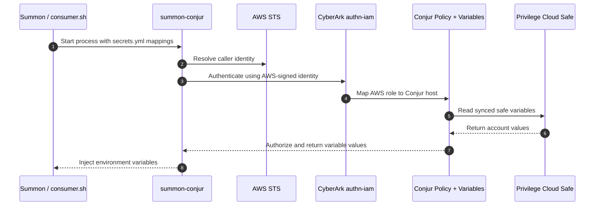

# Demo: Summon AWS Auth

This demo shows Summon on Ubuntu or Linux retrieving secrets from CyberArk Secrets Manager by authenticating with AWS IAM instead of a rotated Conjur API key.

Use the repo-standard docs for deployment and validation:

- `demo_setup.md`
- `demo_validation.md`

## About

- `Summon` starts a child process and injects secrets as environment variables.
- `summon-conjur` authenticates that process to CyberArk using `authn-iam`.
- `authn-iam` validates the AWS caller identity returned by STS and maps it to a Conjur host.
- Conjur authorizes that host to read variables synchronized from the demo safe.
- `consumer.sh` prints the injected values to prove the secrets were delivered to the process.

## Workflow

## Key Files

- `setup.sh`
  Installs Summon, provisions the safe, provisions the Conjur workload, and renders `secrets.yml`.
- `setup/vault/setup.sh`
  Creates the demo safe, grants required members, and creates `account-ssh-user-1`.
- `setup/conjur/setup.sh`
  Resolves the active AWS identity, creates the workload policy, grants `authn-iam` access, and writes `conjur_authn_iam.env`.
- `setup/vars.env`
  Shared demo configuration for safe name, `authn-iam` service ID, and AWS region.
- `demo.sh`
  Loads the runtime environment, prints the AWS caller identity, and runs Summon.
- `consumer.sh`
  Prints the injected variables so the retrieval result is visible.
- `secrets.tmpl.yml`
  Template for the safe-backed `!var` paths.
- `test_runner.sh`
  Runs setup and validation non-interactively and captures artifacts.
