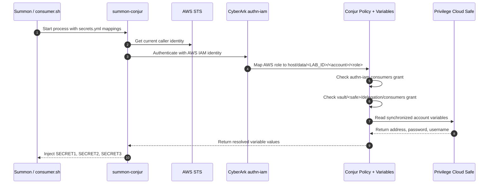

# Summon AWS Auth Validation

This validation guide assumes the demo is already installed and that `./setup.sh` has completed successfully.

## Start Here

Work from the demo directory:

```bash
cd demos/secrets_manager/summon_aws_auth
```

Load the runtime environment generated during setup:

```bash
source ./conjur_authn_iam.env
```

This demo proves that a local Linux process can authenticate to CyberArk with AWS IAM, map that AWS role to a Conjur host, and retrieve safe-backed variables through Summon without using a Conjur API key.

## About

The main components are:

- `Summon`
  Starts the target process and injects variables from `secrets.yml`.
- `summon-conjur`
  Authenticates the process to CyberArk and resolves each `!var` path.
- `authn-iam`
  Validates the live AWS identity and maps it to the configured Conjur host.
- `Conjur`
  Enforces policy and serves the synchronized variable values.
- `Privilege Cloud safe`
  Holds the source account that was synchronized into Conjur.

The important CyberArk controls in this demo are:

- the AWS caller must resolve to the same account and role path used to build `WORKLOAD_HOST_ID`
- the derived Conjur host must belong to the `authn-iam/<service-id>/consumers` group
- the same host must belong to `vault/<safe-name>/delegation/consumers`

If either grant is missing, the flow breaks in a predictable way:

- missing `authn-iam` grant: authentication fails
- missing safe delegation grant: authentication succeeds, but variable lookup fails

## Workflow



Read the diagram left to right:

1. `demo.sh` starts Summon with the rendered `secrets.yml`.
2. `summon-conjur` authenticates through `authn-iam`, not through `authn` with an API key.
3. CyberArk maps the AWS identity to the derived host ID in `conjur_authn_iam.env`.
4. Conjur enforces both authentication and safe-consumer authorization.
5. The resolved values are injected only into the lifetime of `consumer.sh`.

## Core Validation

Confirm the runtime variables are loaded:

```bash
env | grep -E '^(CONJUR|AUTHN_IAM|WORKLOAD_HOST_ID|AWS_)' | sort
```

Confirm the active AWS principal:

```bash
aws sts get-caller-identity
```

Inspect the resolved Summon mapping:

```bash
cat ./secrets.yml
```

Run the demo:

```bash
./demo.sh
```

Success looks like this:

- `aws sts get-caller-identity` returns the expected AWS account and role
- `CONJUR_AUTHN_TYPE` is `iam`
- `secrets.yml` points to `data/vault/<safe-name>/account-ssh-user-1/...`
- `demo.sh` prints the Conjur appliance, service ID, and host ID
- `consumer.sh` prints non-empty values for `SECRET1`, `SECRET2`, and `SECRET3`

What this proves:

- the host is using AWS IAM authentication rather than a static Conjur credential
- the resolved AWS identity matches the workload identity CyberArk expects
- the safe synchronization and Conjur authorization path are both working
- Summon injects the secrets into the child process at runtime

## Pattern 1: AWS IAM Identity Mapping

This pattern proves how CyberArk decides who the workload is.

What identity and access controls matter:

- the AWS caller ARN returned by STS
- the derived Conjur host in `WORKLOAD_HOST_ID`
- membership in the `authn-iam` consumers group

Validate the mapping inputs:

```bash
printf '%s\n' "$AWS_CALLER_ARN"
printf '%s\n' "$WORKLOAD_HOST_ID"
printf '%s\n' "$CONJUR_AUTHN_LOGIN"
printf '%s\n' "$CONJUR_AUTHN_URL"
aws sts get-caller-identity
```

What the result proves:

- the local machine has a usable AWS role identity
- setup captured that identity and generated a matching Conjur host path
- the runtime is targeting the correct `authn-iam` service

CyberArk behavior:

- `summon-conjur` signs an AWS IAM request and sends it to `authn-iam`
- CyberArk verifies the AWS identity and maps it to `host/$WORKLOAD_HOST_ID`
- the request can continue only if that host was granted membership in the `authn-iam` consumers group

## Pattern 2: Safe-Backed Secret Retrieval Through Summon

This pattern proves how the authenticated workload reads synchronized variables from the safe.

What identity and access controls matter:

- the same workload host must be in `vault/<safe-name>/delegation/consumers`
- the rendered `!var` paths must point to the synchronized safe variables

Validate the secret map and run the retrieval:

```bash
cat ./secrets.yml
summon --provider summon-conjur -f ./secrets.yml bash ./consumer.sh
```

What the result proves:

- the demo safe synchronized into Conjur under `data/vault/<safe-name>`
- the workload host is authorized to read the synchronized variables
- Summon can inject the resolved values into an ordinary shell process

CyberArk behavior:

- Conjur resolves each `!var` entry in `secrets.yml`
- the values come from safe synchronization, not from a local file or static variable set in the host shell
- the consumer process receives the secrets as environment variables only while that process runs

## Compare The Patterns

- Pattern 1 explains authentication: who the workload is and why CyberArk trusts it.
- Pattern 2 explains authorization and delivery: what that workload can read and how the values reach the process.

Both must succeed for the demo to work. Authentication alone is not enough if the safe delegation grant is missing.

## Troubleshooting

- If `aws sts get-caller-identity` fails, the problem is on the AWS credential side and CyberArk will not be able to map the workload.
- If `CONJUR_AUTHN_URL` or `CONJUR_AUTHN_LOGIN` is empty, re-run `bash ./setup/conjur/setup.sh` and re-source `./conjur_authn_iam.env`.
- If authentication fails, compare the live STS ARN with `AWS_CALLER_ARN` in `conjur_authn_iam.env`. A different role session usually means the derived host no longer matches.
- If authentication succeeds but Summon cannot resolve variables, inspect `secrets.yml` and confirm the safe name matches the synchronized safe.
- If secret lookup fails after a safe change, confirm `account-ssh-user-1` still exists in the demo safe and that synchronization has completed.
- For a full unattended validation run with captured logs, execute `bash ./test_runner.sh`.
